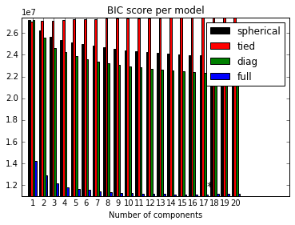
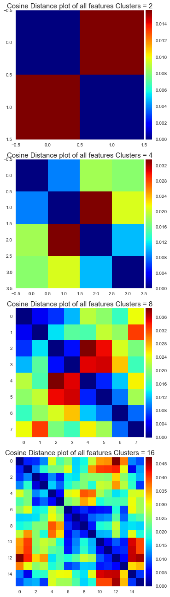
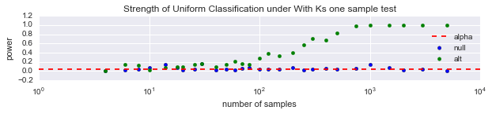
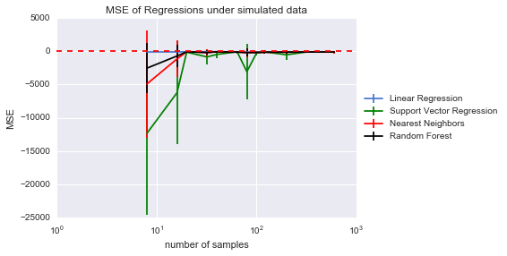

## Progress Report - March 24th, 2016
**Table of Contents:**
- [Overview](./progress_report.MD#overview)
- [Scientific Questioning](./progress_report.MD#scientific-questioning)
    - [Descriptive Analysis](./progress_report.MD#descriptive-analysis)
    - [Exploratory Analysis](./progress_report.MD#exploratory-analysis)
    - [Inferential Analysis](./progress_report.MD#inferential-analysis)
    - [Predictive Analysis](./progress_report.MD#predictive-analysis)
    - [Testing Assumptions](./progress_report.MD#testing-assumptions)
    - [Next Steps](./progress_report.MD#next-steps)
- [Methods](./progress_report.md#methods)
    - [Decriptive Analysis](./progress_report.MD#descriptive-analysis-1)
    - [Exploratory Analysis](./progress_report.MD#exploratory-analysis-1)
    - [Inferential Analysis](./progress_report.MD#inferential-analysis-1)
    - [Predictive Analysis](./progress_report.MD#predictive-analysis-1)
    - [Testing Assumptions](./progress_report.MD#testing-assumptions-1)

--------

### Overview
Currently, very little is understood about the synaptic connections within our brain. Our original belief is that there are only two types of synapses: excitatory and inhibitory. However, it is now known that there is a much more diverse synapse population. We want to characterize these different subpopulations.

### Scientific Questionsing
Here we discuss our analysis of the data.

### Descriptive Analysis
Our data is a organized into a feature matrix and a location matrix. Our feature matrix is (1119299, 144), but we trim it down to (1119299, 96). Each 24 columns represent one measurement metric/channel of data. 

The measurement metrics are:
    f0 = integrated brightness 
    f1 = local brightness 
    f2 = distance to Center of Mass 
    f3 = moment of inertia around synapse
each with a shape of (1119299, 24).

Each channel/measurement has 24 data points representing 4 different protein markers, ordered as the following: 

['Synap', 'Synap', 'VGlut1', 'VGlut1', 'VGlut2', 'Vglut3', 'psd', 'glur2', 'nmdar1', 'nr2b', 'gad', 'VGAT', 'PV', 'Gephyr', 'GABAR1', 'GABABR', 'CR1', '5HT1A', 'NOS', 'TH', 'VACht', 'Synapo', 'tubuli', 'DAPI']

The location data is (1119299, 3). They represent pixel locations on a 3D image with resolution at the nm scale. 

The ranges on each axis are:
- x: [28, 1513]
- y: [23, 12980]
- z: [2, 40]

### Exploratory Analysis
First we looked at our feature data.

We notice that there is some sort of trend within the correlations of all 96 measurements vs. each other. We therefore apply a thresholding to get a better sense of which columns are highly correlated. We applied a threshold of 0.6.

Now we notice that the integrated brightness correlates across its features a lot. This could be due to the fact that brightness in 1 protein marker leaks over to another if they are close in space? This could allow us to condense f0, when performing cluster analysis and also motivates us to further analyze f0 because of its higher correlative properties relative to the other features. 

Later, we also can use an independence test to determine if the features that are relatively more correlated are independent, or dependent. We would have to make use of downsampling to make this feasible.

Next, we also look at the distribution of our synapses in space. 

We notice that on a first glance that our locations are uniformly distributed. However, we can test this assumption later.

### Inferential Analysis
Now, we wanted to determine the optimal number of clusters using a Gaussian Mixture Model. This assumes that our feature data is normally distributed, which may or may not be the case. We also wanted to test if our locations were indeed normally distributed.

Running a Kolmogorov-Smirnov test for uniformity, we determined that none of the x,y,z locations were uniformly distributed.

- x: KstestResult(statistic=0.08121982036477704, pvalue=0.0)
- y: KstestResult(statistic=0.061234766392988749, pvalue=0.0)
- z: KstestResult(statistic=0.070538814918980508, pvalue=0.0)

We used a likelihood ratio test statistic to determine the optimal number of clusters for a GMM of our feature data. 

### Predictive Analysis
We attempted to make regressions of one column of data from other columns of data. We fit several regressors and tested using LOO cross-validation with K folds. All MSE's were very small ~e-03, which could be due to overfitting by regressing on all 95 other columns.

### Testing Assumptions
Up to this point, our analysis has made two large assummptions about our data: our feature data was sampled independently and identially and if our data is sampled normally to allow for a GMM.

Using a multiscale clustering method with K-Means of 2 each time, we found 16 centroids and looked at the distances between each centroid. Theoretically these should be all relatively distanced from each other if 17 is the optimal # of clusters. However, we do see some block diagonality, which suggests otherwise. We used a Henze-Zirkler test for multivariate normality, which shows that our data is indeed not normally distributed. 

In order to test for normality, we used the energy package from R, but it would not scale well suggesting that we need to downsample our data and try again.

### Next Steps

### Methods
Each of the questions required code and (for the inferential, predictive, and assumption checking portions) mathematical theory. This is all explained in detail in each file, tabulated below. Here, we will discuss the methods used in each of these sections, rationalize decision made, and discuss alternatives that could have been performed instead.

| Question Type | Code |
|---------------|------|
| Descriptive and Exploratory | [**``./exploratory_analysis_AL.ipynb``**](./exploratory_analysis_AL.ipynb) |
| Inferential | [**``./inferential_simulation_AL.ipynb``**](./inferential_simulation_AL.ipynb) |
| Predictive  | [**``./classificationANDregression_simulation_AL.ipynb``**](./classificationANDregression_simulation_AL.ipynb) |
| Testing Assumptions | [**``./testing_assumptions_AL.ipynb``**](./testing_assumptions_AL.ipynb) |

#### Descriptive Analysis
When answering descriptive questions, we sought out values which could summarize the dataset. Our sample sizes, feature matrix sizes, and amount of obviously invalid data were chosen because they would be important in virtually any downstream task. More complicated features could have also been looked at, such as dynamic range of edge weights, or distribution of genders in each dataset as well.

#### Exploratory Analysis
Four exploratory questions were answered here: shape of features, range of locations, histograms of location distribution, and identification of clusters. The feature correlations were computed with a standard correlation computation. Then the plot had a threshold applied to binarize the low correlations.

There was very limited computation or design when computing the histograms.

Clusters were fit using the scikit learn implementation of mini-batch k-means for various values of k, the number of clusters. The optimal model was chosen as the model that minimized BIC. 

#### Inferential Analysis
The following figure is a simulation of the power of the KS-test with increasing n and the Wilcoxon Rank test.

We also simulated the power of the likelihood ratio test statistic for gaussian mixture models. 

#### Predictive Analysis
This simulated the accuracy of our regressors with increasing n. 

#### Testing Assumptions
When performing any analysis that requires assumptions, it is wise to test the assumptions made. We made three types of assumptions here: samples are independent, samples are identical, and there exists a gaussian mixture model. For testing independence, we chose to look at linear dependence. We computed the covariance matrix across all samples. If a significant portion of the covariance matrix lay in the off diagonal, we could say that the samples were not linearly independent.

We could also downsample and compute an independence test using RPy.

The gaussian mixture model test for number of mixture components assumes, as the name suggests, that the data is a mixture of gaussians. Tests for normality of each mixture component is one way to determine if this assumption is violated. Q-Q plots of each mixture component also provides a visual indicator of deviance from normality.
