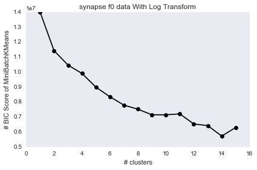
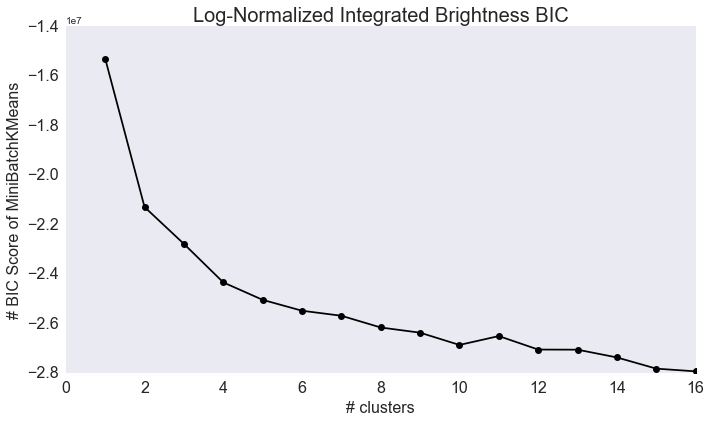
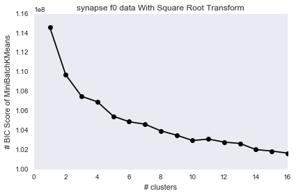
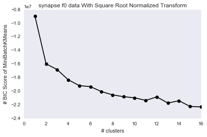
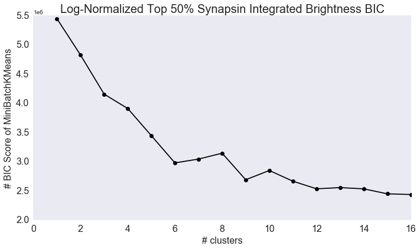
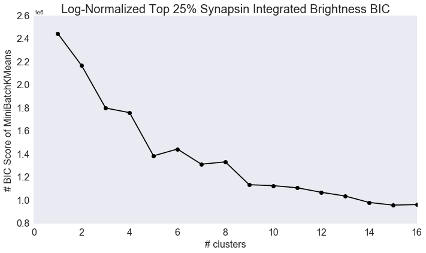

### Human Connectome Discovery
***Adam Li and Tyler tomita***  
May 1, 2016

-------

**Table of Contents:**
- [Overview](./final_report.md#overview)
- [Scientific Questioning](./final_report.md#scientific-questioning)
  - [Decriptive Analysis](./final_report.md#descriptive-analysis)
  - [Exploratory Analysis](./final_report.md#exploratory-analysis)
  - [Inferential Analysis](./final_report.md#inferential-analysis)
  - [Predictive Analysis](./final_report.md#predictive-analysis)
  - [Testing Assumptions](./final_report.md#testing-assumptions)
  - [Extended Exploratory Analysis](./final_report.md#extended-exploratory-analysis)
  - [Dimensionality Reduction](./final_report.md#dimensionality-reduction)
- [Methods](./final_report.md#methods)
  - [Decriptive Analysis](./final_report.md#descriptive-analysis-1)
  - [Exploratory Analysis](./final_report.md#exploratory-analysis-1)
  - [Inferential Analysis](./final_report.md#inferential-analysis-1)
  - [Predictive Analysis](./final_report.md#predictive-analysis-1)
  - [Testing Assumptions](./final_report.md#testing-assumptions-1)
  - [Extended Exploratory Analysis](./final_report.md#extended-exploratory-analysis-1)
  - [Dimensionality Reduction](./final_report.md#dimensionality-reduction-1)

----------

### Overview
Currently, very little is understood about the synaptic connections within our brain. Our original belief is that there are only two types of synapses: excitatory and inhibitory. However, it is now known that there is a much more diverse synapse population. We want to characterize these different subpopulations.

### Scientific Questionsing
Here we discuss our analysis of the data.

### Descriptive Analysis
Our data is a organized into a feature matrix and a location matrix. Our feature matrix is (1119299, 144), but we trim it down to (1119299, 96). Each 24 columns represent one measurement metric/channel of data. 

The measurement metrics are:
    f0 = integrated brightness 
    f1 = local brightness 
    f2 = distance to Center of Mass 
    f3 = moment of inertia around synapse
each with a shape of (1119299, 24).

Each channel/measurement has 24 data points representing 4 different protein markers, ordered as the following: 

['Synap', 'Synap', 'VGlut1', 'VGlut1', 'VGlut2', 'Vglut3', 'psd', 'glur2', 'nmdar1', 'nr2b', 'gad', 'VGAT', 'PV', 'Gephyr', 'GABAR1', 'GABABR', 'CR1', '5HT1A', 'NOS', 'TH', 'VACht', 'Synapo', 'tubuli', 'DAPI']

The location data is (1119299, 3). They represent pixel locations on a 3D image with resolution at the nm scale. 

The ranges on each axis are:
- x: [28, 1513]
- y: [23, 12980]
- z: [2, 40]

****** ADD ANY DESCRIPTIVE THINGS I DIDN'T ADD YET *********

### Exploratory Analysis
In our exploratory analysis, we analyzed each metric separately first:
- f0, f1, f2 and f3. 
- filter out bottom 25, 50, 75% of synap values

Here, we performed various transformations and then correspondingly made Bayesian Information Criterion (BIC) plots, to determine some optimal clustering k.

1. f0 - Integrated Brightness
    * Log-transformed data with BIC of up 16 clusters.

    

    * LogNormalized-transformed data with BIC of up 16 clusters.

    

    * Sqrt-transformed data with BIC of up 16 clusters.

    

    * SqrtNormalized-transformed data with BIC of up 16 clusters.

    
    
    Then we decided to filter out the bottom 25, 50 and 75% of synap values (rows) and try on the log-normalized data again.
    
    * SqrtNormalized-transformed data with BIC of up 16 clusters; filtered out bottom 25% synap values.

    
    
    * SqrtNormalized-transformed data with BIC of up 16 clusters; filtered out bottom 50% synap values.

    
    
    * SqrtNormalized-transformed data with BIC of up 16 clusters; filtered out bottom 75% synap values.

    
    
#### Inferential Analysis
We now seek to understand class conditional differences within our datasets. From here, we will be only looking at the KKI2009 dataset. The covariate we are seeking to separate graphs based upon is sex. Firstly we must pick a feature of our graphs to test this difference under. As we'd looked at this feature in our exploratory analysis, we chose to use edge density as our feature. Running a wilcoxon test on this population, in which 22 subjects were male and 20 subjects were female, we found the following mean probabilities of edge based on class.

| Class | Mean edge probability |
|-------|-----------------------|
| Female| 0.014041836735        |
| Male  | 0.013130376117        |

We found that the difference between these populations was statistically significant with an alpha value of 0.05, produciing a p value of 0.022768743719. Since we found a statistically significant difference between classes, we can naturally proceed to trying to classify subjects based on their edge density.

#### Predictive Analysis
Now that a class conditional edge probability difference has been observed, we can attempt to explot this to classify subjects. Several types of classifiers were trained and tested using LOO cross-validation, and their results are tabulated below. Note that chance classification in this dataset is 47% accuracy, since the dataset has more males than females.

| Classifier | Accuracy | Standard Deviation |
|------------|----------|--------------------|
|Nearest Neighbors | 0.48 | +/- 1.00 |
|Linear SVM | 0.55 | +/- 1.00 |
|Random Forest| 0.57 | +/- 0.99 |
|Linear Discriminant Analysis| 0.45 | +/- 1.00 |
|Quadratic Discriminant Analysis| 0.71 | +/- 0.90|

Here we notice that with the only classifier which performs significantly better than chance is the Quadratic Discriminant Analysis. In order to gain some understanding as to why this is the case, we proceed to reevaluate our procedure thus far and test the assumptions we've been making up until this point.

#### Testing Assumptions
Up to this point, our analysis had made two large assumptions about our data: the graphs are sampled idependently and identically, and edges within the graph were sampled independently and identically. Another assumption made implicitly when doing classification with QDA that differs from the other techniques is that our covariance matrix differs across classes. Here, we test each of these assumptions to see if we can impove our model.

First, we test whether the graphs are sampled independently from each other and identically. Plotted below is the covariance matrix of our graphs. Significant content in the off-diagonal suggests that these graphs are in fact dependent. Below that, is a figure which plots the BIC score when doing GMM clustering on the graphs. We see that the optimal number of clusters is greater than 1, suggesting they are not identically distributed, either.

Next, we investigate the same properties about our edges. Shown below are the same two figures for edges rather than graphs. We again notice lots of content in the off-diagonal of our covariance matrix, suggesting dependence between edges. Notice in the identical test, however, that a clear "optimal" number of clusters does exist whereas previously the plot seemed monotonically increasing. Here we notice an optimal clustering of 4, which can later be leveraged when doing clustering or classification.

Finally, we test whether or not the assumption made implicitly in QDA, that our classes have different covariance matrices, is true. Shown below is a plot of each of the class covariance matrices, as well as a plot of the absolute difference of this matrix. We can see a significant difference in this matrix, which suggests why QDA outperformed the other methods (certainly LDA, which explicitly assumes classes have an identical covariance matrix).

#### Next Steps
Thus far we have learned a fair amount about the edge densities and properties of our data. Moving forward, we can analyze the mean and covariance of the clusters found in our assumption checking, and cluster our data prior to testing hypotheses and classifying over covariates. We can also expand to regressing subject age, with several methods. Finally, once we are confident in and satisfied with a method testing on this dataset, we can expand towards testing the method on the MRN114 and SWU4 datasets, as well.

#### Extended Exploratory Analysis
Here we explored the data in much more detail than we had previously. We investigated properties such as: clusering coefficient, betweeneness centrality, vertex degree, number of non zero edges, eigen values, edge weights, number of 3-cliques, and scan statistics. These analyses were performed on the KKI2009, SWU4, and MRN114 datasets.

The clustering coefficient for the datasets is as is shown below. It can be seen that the KKI2009 dataset is quite consistent across subjects, while the other two datasets appear bimodal, and very closely resemble each other in terms of the portion of subjects belong to each mode.

The betweenness centrality is a metric which assesses the centrality of each node by counting the portion of shortest paths between all other nodes in the graphs it lies on.

The degree sequence shows the distribution of degrees of nodes within the graphs. The MRN114 and SWU4 datasets appear more connected than the KKI2009 dataset, as the median is shifted to the right for these datasets.

The number of non zeros in a graph counts the unweighted edges. In these graphs, there are 70 nodes, so the maximum number of edges is 2415.

As these are weighted graphs, the distribution of edge weights is also of interest. We see most edges are very small weights, which suggests most connections observed in the graph are not "strong" from a robust standpoint (i.e. only few fibers connect the regions, rather than many).

The scan statistic-1 counts the number of edges within a local neighbourhood.

The eigen values of the system were the last feature we looked at of the graphs, and are seen below.

#### Dimensionality Reduction

When analyzing high dimensional data with few samples, it is often very benficial to reduce the dimensions of the data. It is valuable to create scree-plots of the data to see how many dimensions your data can be effectively represented in. Here we showed scree plots across more datasets and three different scales of graphs (i.e. different numbers of nodes). It is interesting to note that across datasets the mean elbows are very consistent within a scale.

### Methods
Each of the questions required code and (for the inferential, predictive, and assumption checking portions) mathematical theory. This is all explained in detail in each file, tabulated below. Here, we will discuss the methods used in each of these sections, rationalize decision made, and discuss alternatives that could have been performed instead.

| Question Type | Code |
|---------------|------|
| Descriptive | [**``./code/descriptive_and_exploratory_answers.ipynb``**](./code/descriptive_and_exploratory_answers.ipynb) |
| Exploratory | [**``./code/descriptive_and_exploratory_answers.ipynb``**](./code/descriptive_and_exploratory_answers.ipynb) |
| Inferential | [**``./code/inferential_simulation.ipynb``**](./code/inferential_simulation.ipynb) |
| Predictive  | [**``./code/classification_simulation.ipynb``**](./code/classification_simulation.ipynb) |
| Testing Assumptions | [**``./code/test_assumptions.ipynb``**](./code/test_assumptions.ipynb) |
| Extended Exploratory | [**``code/extended_exploratory.ipynb``**](code/extended_exploratory.ipynb),  [**``./code/extended_exploratory-on-new-datasets.ipynb``**](./code/extended_exploratory-on-new-datasets.ipynb) |
| Sample Distributions | [**``./code/multiple_distributions.ipynb``**](./code/multiple_distributions.ipynb) |
| Dimensionality Reduction | [**``./code/scree_plots.md``**](./code/scree_plots.md), [**``./code/multipanel_scree_plots.md``**](./code/multipanel_scree_plots.md) |

#### Descriptive Analysis
When answering descriptive questions, we sought out values which could summarize the dataset. Our sample sizes, graph size, and amount of obviously invalid data were chosen because they would be important in virtually any downstream task. More complicated features could have also been looked at, such as dynamic range of edge weights, or distribution of genders in each dataset as well.

#### Exploratory Analysis
Three exploratory questions were answered here: average degree, average graph, and plotting the histograms of edge weight. The average degree for each graph was computed by summing the binary edge count for each graph and dividing by the number of nodes. The graphs were binarized, but not thresholded or scaled before to remove small magnitude edges. This means that the estimated degree is an upper bound estimate based on these graphs.

The mean connectome was computed simply here due to the graphs being graph matched (i.e. same nodes). The edge-weight for each location was simply averaged across all graphs. We did not do this, but perhaps should (and certainly could) for each individual dataset as well, to see if population specific mean connectomes are significantly different from one another.

There was very limited computation or design when computing the histograms.

#### Inferential Analysis
Here we needed to define a model and test statistic for our hypothesis test. We wanted to test whether or not males and females are sampled from the same distribution, so we chose a test statistic that is a function of distribution: edge probability. We could have fit a GMM or other distribution to our data and then compared them, but as a preliminary measure this enabled us to proceed easily. We also needed to choose a statistical text. We choose the Wilcoxon test because it is a non-parametric test that makes significantly fewer assumptions about the data (i.e. doesn't impose a distribution) than the t-test. In order to prove that our test in fact convered to 1 in power as the number of samples approached infinity under the alternate model (that a class conditional probability exists), and would stay at our alpha value under the null model (no relationship exists), we simulated data that have similar properties to our graphs. Shown below is a figure illustrating that this test converges as desired.

#### Predictive Analysis
Similarly to the inferential analysis, we needed to here specify a model and loss function for our classification task. The model again used edge probability as the feature. Here the loss function was simply the indicator function over assigned label by the classifer compared to true label - if the labels were the same, there was no loss; otherwise, the loss was 1. Here we tested 5 different classifiers on the data and compared their performance. Some of the tests were non-parametric (LDA, QDA), while others were parametric (K-nearest neighbour, Linear SVM, and Random Forest). The parameters chosen for each of these algorithms was not at all tuned to our data, but were the default parameters suggested by the sklearn website, where the implementations were found. Improving this, and choosing parameters that match our assumptions or expectations about our data could drastically improve the performance of these classifiers.

Shown below is a figure illustrating the performance of each of these classifiers tested on simulated data that is sampled from a distribution similar to our observed data.

#### Testing Assumptions
When performing any analysis that requires assumptions, it is wise to test the assumptions made. We made three types of assumptions here: samples are independent, samples are identical, and there exists a class conditional covariance matrix (i.e. classes have different covariances). For testing independence, we chose to look at linear dependence. We computed the covariance matrix across all samples (first this meant graphs were samples, then samples were edges within the graphs), and looked at what portion of this lay in the off diagonal. If a significant portion of the covariance matrix lay in the off diagonal, we could say that the samples were not linearly independent.

For testing whether or not samples were identically distributed, we attempted to cluster the data using a Gaussian Mixture Model while varying the number of clusters. We ran Bayesian Information Criterion (BIC) on all of the clusterings and plotted the curve of BIC values over varying dimension. Where BIC is maximized, we have found the optimal number of clusters for this data (using this clustering method). Therefore, if the ideal number of clusters is 1, we can feel confident that our data may be identically distributed. However, when the optimal BIC is at a higher number, or monotonically increasing, it suggests that our data are not identically distributed.

The final test, which asserts a class conditional covariance, was perhaps the most obvious to test. We computed the covariance of all the data in each class, and then took the difference of the two class covariance matrices. We found that the covariance matrices were very different, which lead us to believe that this assumption was in fact correct.

#### Extended Exploratory Analysis
The library Networkx contains lots of pre-built functions for computing invariants on graphs. Those computed here were all packaged as a part of Networkx, so custom scripts were only written to wrap the management of this processing across graphs and datasets.

#### Dimensionality Reduction
Scree plots show the singular values of the Singular Value Decomposition of a matrix. We took the adjacency matrix of our graphs, and performed the SVD on them. The elbows were found using code provided by Youngser Park, an implementation of the Zhu Ghodsi method published in 2006.
