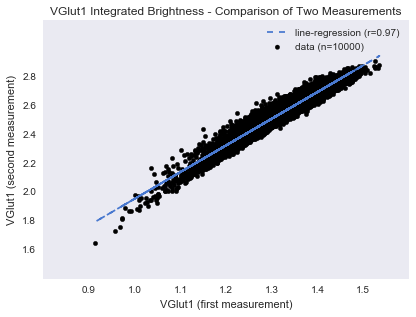
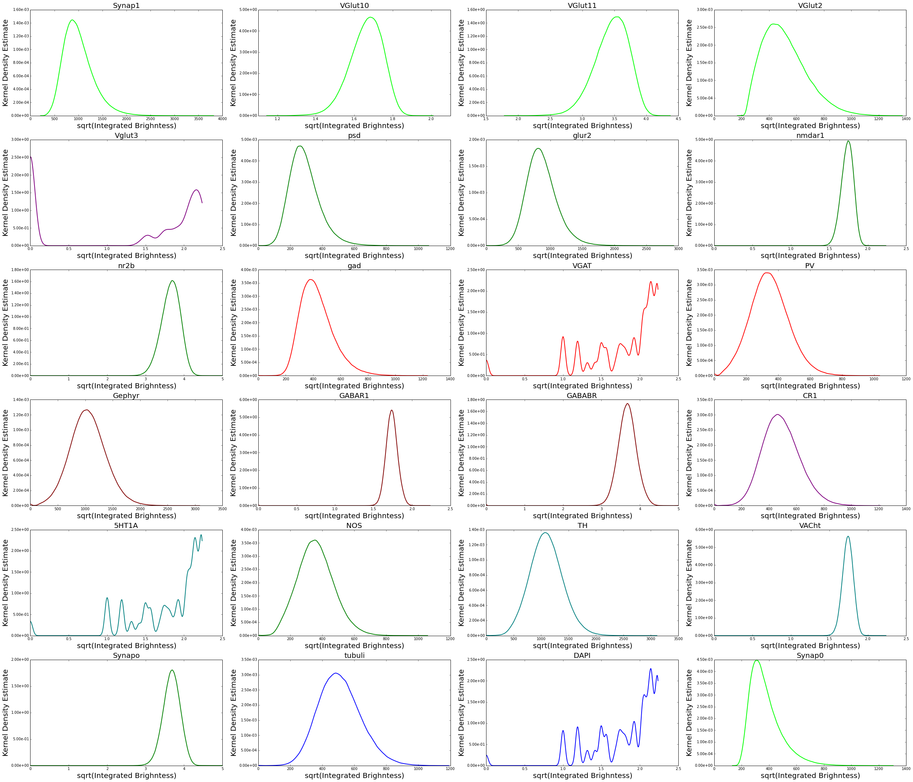
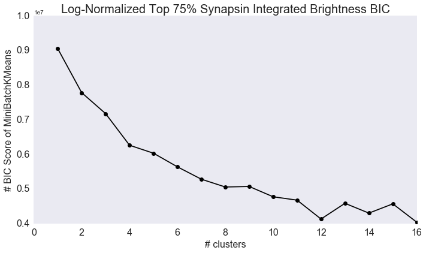
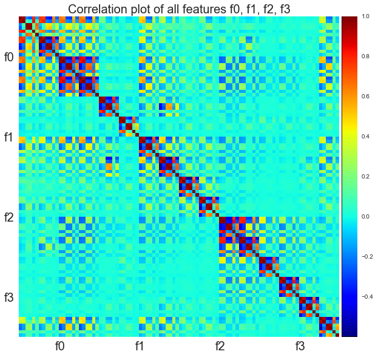
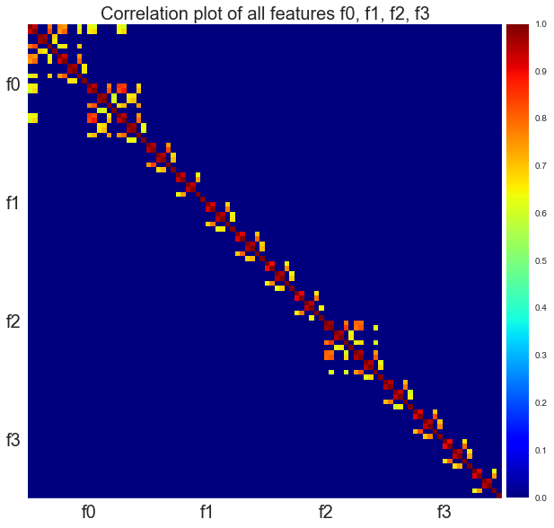
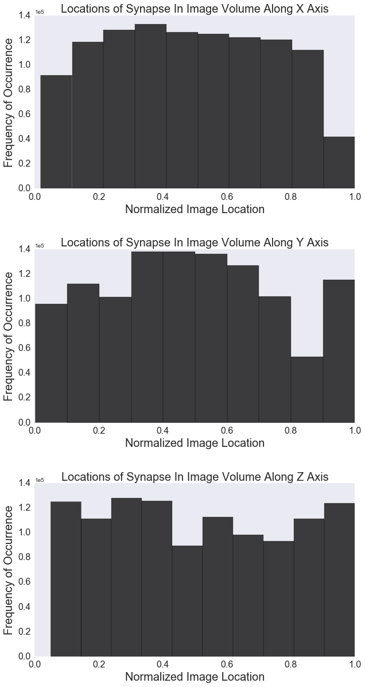

### Human Connectome Discovery
***Adam Li and Tyler tomita***  
May 1, 2016

-------

**Table of Contents:**
- [Overview](./final_report.md#overview)
- [Scientific Questioning](./final_report.md#scientific-questioning)
  - [Decriptive Analysis](./final_report.md#descriptive-analysis)
  - [Exploratory Analysis](./final_report.md#exploratory-analysis)
  - [Inferential Analysis](./final_report.md#inferential-analysis)
  - [Predictive Analysis](./final_report.md#predictive-analysis)
  - [Testing Assumptions](./final_report.md#testing-assumptions)
  - [Extended Exploratory Analysis](./final_report.md#extended-exploratory-analysis)
  - [Dimensionality Reduction](./final_report.md#dimensionality-reduction)
- [Methods](./final_report.md#methods)
  - [Decriptive Analysis](./final_report.md#descriptive-analysis-1)
  - [Exploratory Analysis](./final_report.md#exploratory-analysis-1)
  - [Inferential Analysis](./final_report.md#inferential-analysis-1)
  - [Predictive Analysis](./final_report.md#predictive-analysis-1)
  - [Testing Assumptions](./final_report.md#testing-assumptions-1)
  - [Extended Exploratory Analysis](./final_report.md#extended-exploratory-analysis-1)
  - [Dimensionality Reduction](./final_report.md#dimensionality-reduction-1)

----------

### Overview
Currently, very little is understood about the synaptic connections within our brain. Our original belief is that there are only two types of synapses: excitatory and inhibitory. However, it is now known that there is a much more diverse synapse population. We want to characterize these different subpopulations.

### Scientific Questionsing
Here we discuss our analysis of the data.

### Descriptive Analysis
Our data is a organized into a feature matrix and a location matrix. Our feature matrix is 1119299 x 144, but we trim it down to 1119299 x 96. Each of the 24 columns represent one channel of data. 

The measurement metrics are:
    f0 = integrated brightness 
    f1 = local brightness 
    f2 = distance to Center of Mass 
    f3 = moment of inertia around synapse
each with a shape of 1119299 x 24.

Each measurement metric has 24 channels representing different protein markers, ordered as the following:

['Synap_0', 'Synap_1', 'VGlut1_0', 'VGlut1_1', 'VGlut2', 'Vglut3', 'psd', 'glur2', 'nmdar1', 'nr2b', 'gad', 'VGAT', 'PV', 'Gephyr', 'GABAR1', 'GABABR', 'CR1', '5HT1A', 'NOS', 'TH', 'VACht', 'Synapo', 'tubuli', 'DAPI']

The data collectors have provided domain knowledge regarding groupings of the 24 protein markers. Each marker belongs to one of seven functional groupings. The breakdown is as follows:

| Functional Category | Markers |
|---------------|------|
| Excitatory Presynaptic | Synap_0, Synap_1, VGlut1_0, VGlut1_1, VGlut2 |
| Excitatory Postsynaptic | psd, glur2, nmdar1, nr2b, NOS, Synapo |
| Inhibitory Presynaptic | [gad, VGAT, PV |
| Inhibitory Postsynaptic  | Gephyr, GABAR1, GABABR |
| Inhibitory Presynaptic (small)  | Vglut3, CR1 |
| Other | 5HT1A, TH, VACht |
| None | tubulin, DAPI |

The location data is a 1119299 x 3 matrix. They represent pixel locations on a 3D image with resolution at the nm scale. 

The ranges on each axis are:
- x: [28, 1513]
- y: [23, 12980]
- z: [2, 40]

### Exploratory Analysis
As a first quality control step, we checked to see if the two repeating measurements (Synap_0 and Synap_1) were taken correctly. If they were, then they should be linearly correlated.
 
 

Next, we utilized various exploratory tools to try to understand the data better. First, we analyzed each metric separately:
- f0, f1, f2 and f3. 
- filter out bottom 25, 50, 75% of synap values

f0 seemed to be the most informative metric, so most of the analyses were focused around this metric. Since the scales of each channel for f0 seemed to vary widely, we applied various transformations, including log, 0-1 normalization then log, square root, and 0-1 normalization then square root. For log transformations, we had to add one because of the zeros in the original data. For each transformation, we plotted kernel density estimates. Plots are color-coded according to functional category. Unfortunately, the histrograms could not be well visualized on a single set of axes because of the large variance in scale, hence the individual subplots.

Many of the untransformed channels have heavy right or left tails, and the scales vary widely. Both square root and log transformations seem to help make the data more Gaussian, and also make the channels more commensurate. Having commensurate data is crucial to some of the procedures that follow.

Additionally, we wanted to see how channels correlated with each other. For each transformation, we computed the correlation matrix for f0:

Pairwise Peason's correlation seems to be largely unaffected by the type of transformation. We see correlations that we would hope to see. For instance, psd and glur2, which are both excitatory postsynaptic types, have a correlation of ~.93. However, we also see correlations that we wouldn't expect, such as a correlation of ~.83 for gad (inhibitory presynaptic) and glur2 (excitatory postsynaptic).

Here, we performed various transformations and then correspondingly made Bayesian Information Criterion (BIC) plots, to determine some optimal clustering k.

1. f0 - Integrated Brightness
    * Log-transformed data with BIC of up 16 clusters.

    

    * LogNormalized-transformed data with BIC of up 16 clusters.

    

    * Sqrt-transformed data with BIC of up 16 clusters.

    

    * SqrtNormalized-transformed data with BIC of up 16 clusters.

    
    
    Then we decided to filter out the bottom 25, 50 and 75% of synap values (rows) and try on the log-normalized data again.
    
    * LogNormalized-transformed data with BIC of up 16 clusters; filtered out bottom 25% synap values.

    
    
    * LogNormalized-transformed data with BIC of up 16 clusters; filtered out bottom 50% synap values.

    
    
    * LogNormalized-transformed data with BIC of up 16 clusters; filtered out bottom 75% synap values.

    

2. f1 - local brightness
 
    * LogNormalized-transformed data with BIC of up 16 clusters.

    
    
    * LogNormalized-transformed data with BIC of up 16 clusters; filtered out bottom 25% synap values.

    
    
    * LogNormalized-transformed data with BIC of up 16 clusters; filtered out bottom 50% synap values.

    
    
    * LogNormalized-transformed data with BIC of up 16 clusters; filtered out bottom 75% synap values.

    

3. f2 - Distance to Center of Mass
 
    * LogNormalized-transformed data with BIC of up 16 clusters.

    
    
    * LogNormalized-transformed data with BIC of up 16 clusters; filtered out bottom 25% synap values.

    
    
    * LogNormalized-transformed data with BIC of up 16 clusters; filtered out bottom 50% synap values.

    
    
    * LogNormalized-transformed data with BIC of up 16 clusters; filtered out bottom 75% synap values.

    

4. f3 - Moment of Inertia Around Center of Mass
 
    * LogNormalized-transformed data with BIC of up 16 clusters.

    
    
    * LogNormalized-transformed data with BIC of up 16 clusters; filtered out bottom 25% synap values.

    
    
    * LogNormalized-transformed data with BIC of up 16 clusters; filtered out bottom 50% synap values.

    
    
    * LogNormalized-transformed data with BIC of up 16 clusters; filtered out bottom 75% synap values.

    

Discussion on BIC Plots: Generally, there seems to be an elbow at 4,5 or 6 clusters (visually). It would be interesting to determine how these clusters actually looked. Additional steps would be to cluster with a certain k, and look at the covariance matrix of the different clusters and plots of the various clusters.
    
Now, we also looked at the entire feature set as a whole.

We notice that there is some sort of trend within the correlations of all 96 measurements vs. each other. We therefore apply a thresholding to get a better sense of which columns are highly correlated. We applied a threshold of 0.6.

Now we notice that the integrated brightness correlates across its features a lot. This could be due to the fact that brightness in 1 protein marker leaks over to another if they are close in space? This could allow us to condense f0, when performing cluster analysis and also motivates us to further analyze f0 because of its higher correlative properties relative to the other features. 

Later, we also can use an independence test to determine if the features that are relatively more correlated are independent, or dependent. We would have to make use of downsampling to make this feasible.

Next, we also look at the distribution of our synapses in space. 

We notice that on a first glance that our locations are uniformly distributed. However, we can test this assumption later.
    
#### Inferential Analysis
Now, we wanted to determine the optimal number of clusters using a Gaussian Mixture Model. This assumes that our feature data is normally distributed, which may or may not be the case. We also wanted to test if our locations were indeed normally distributed.

Running a Kolmogorov-Smirnov test for uniformity, we determined that none of the x,y,z locations were uniformly distributed.

- x: KstestResult(statistic=0.08121982036477704, pvalue=0.0)
- y: KstestResult(statistic=0.061234766392988749, pvalue=0.0)
- z: KstestResult(statistic=0.070538814918980508, pvalue=0.0)

We used a likelihood ratio test statistic to test for the number of clusters in a GMM of our feature data. The null hypothesis was that there is one mixture component, while the alternative was that there is 17. The result of the test indicated a p-value close to zero, meaning that we can strongly reject the null in favor of the alternative.

#### Predictive Analysis
We attempted to make regressions of one column of data from other columns of data. We fit several regressors and tested using LOO cross-validation with K folds. All MSE's were very small ~e-03, which could be due to overfitting by regressing on all 95 other columns.

#### Testing Assumptions
Up to this point, our analysis has made two large assummptions about our data: our feature data was sampled independently and identially and if our data is sampled normally to allow for a GMM.

Using a multiscale clustering method with K-Means of 2 each time, we found 16 centroids and looked at the distances between each centroid. Theoretically these should be all relatively distanced from each other if 17 is the optimal # of clusters. However, we do see some block diagonality, which suggests otherwise. 

We used a Henze-Zirkler test for multivariate normality, which shows that our data is indeed not normally distributed. In order to test for independence, we used the energy package from R, but it would not scale well suggesting that we need to downsample our data and try again.

Each of the questions required code and (for the inferential, predictive, and assumption checking portions) mathematical theory. This is all explained in detail in each file, tabulated below. Here, we will discuss the methods used in each of these sections, rationalize decision made, and discuss alternatives that could have been performed instead.

| Question Type | Code |
|---------------|------|
| Descriptive and Exploratory | [**``./exploratory_analysis_AL.ipynb``**](./Code/exploratory_analysis_AL.ipynb), [**``./Exploratory_analysis_tyler.ipynb``**](./Code/Exploratory_analysis_tyler.ipynb) |
| Inferential | [**``./inferential_simulation_AL.ipynb``**](./Code/inferential_simulation_AL.ipynb), [**``./inference_tyler.ipynb``**](./Code/inference_tyler.ipynb) |
| Predictive  | [**``./classificationANDregression_simulation_AL.ipynb``**](./Code/classificationANDregression_simulation_AL.ipynb) |
| Testing Assumptions | [**``./testing_assumptions_AL.ipynb``**](./Code/testing_assumptions_AL.ipynb), [**``./assumption_checking_tyler.ipynb``**](./Code/assumption_checking_tyler.ipynb) |
| Extended Exploration | [**``./Code/newexploring/exploratory_analysis.ipynb``**](./Code/newexploring/exploratory_analysis.ipynb), [**``./exploratory_analysis_tyler2.ipynb``**](./Code/exploratory_analysis_tyler2.ipynb) |
| Clustering Analysis | [**``./Code/newexploring/clustering_analysis.ipynb``**](./Code/newexploring/clustering_analysis.ipynb) |

# METHODS
#### Descriptive Analysis
When answering descriptive questions, we sought out values which could summarize the dataset. Our sample sizes, feature matrix sizes, and amount of obviously invalid data were chosen because they would be important in virtually any downstream task. More complicated features could have also been looked at, such as dynamic range of edge weights, or distribution of genders in each dataset as well.

#### Exploratory Analysis
Four exploratory questions were answered here: shape of features, range of locations, histograms of location distribution, and identification of clusters. The feature correlations were computed with a standard correlation computation. Then the plot had a threshold applied to binarize the low correlations.

There was very limited computation or design when computing the histograms.

Clusters were fit using the scikit learn implementation of mini-batch k-means for various values of k, the number of clusters. The optimal model was chosen as the model that minimized BIC. 

#### Inferential Analysis
The following figure is a simulation of the power of the KS-test with increasing n and the Wilcoxon Rank test.

We also simulated the power of the likelihood ratio test statistic for gaussian mixture models. 

#### Predictive Analysis
This simulated the accuracy of our regressors with increasing n. 

#### Testing Assumptions
When performing any analysis that requires assumptions, it is wise to test the assumptions made. We made three types of assumptions here: samples are independent, samples are identical, and there exists a gaussian mixture model. For testing independence, we chose to look at linear dependence. We computed the covariance matrix across all samples. If a significant portion of the covariance matrix lay in the off diagonal, we could say that the samples were not linearly independent.

We could also downsample and compute an independence test using RPy.

The gaussian mixture model test for number of mixture components assumes, as the name suggests, that the data is a mixture of gaussians. Tests for normality of each mixture component is one way to determine if this assumption is violated. Q-Q plots of each mixture component also provides a visual indicator of deviance from normality.    

#### Dimensionality Reduction

When analyzing high dimensional data with few samples, it is often very benficial to reduce the dimensions of the data. It is valuable to create scree-plots of the data to see how many dimensions your data can be effectively represented in. Here we showed scree plots across more datasets and three different scales of graphs (i.e. different numbers of nodes). It is interesting to note that across datasets the mean elbows are very consistent within a scale.

Using PCA, we generated scree plots on the log-normalized data on. It is noticable that we can reduce the dimensionality of the f0 feature matrix down to ~5 principle components to cover 90% of the variance in the integrated brightness features.

## Next Steps:
Clustering Analysis:
- Since doing the clustering analysis on the f0 features, it would be interesting to produce covariance matrices of all the metrics when clustering and also the clustered plots for f1, f2 and f3.
- Using other clustering algorithms on k=2 to compare for distributions of protein expression values. We can try k-medoids, random forest, svm, ward clustering 
- Another option would be to create an affinity matrix of a random subset of the rows of the features by having it connected with synapses close in space
    - then we can also apply spectral clustering
    
- Can try all these things with PCA reducing the number of principle components to 8/9 to account for ~99% of the variance. 

